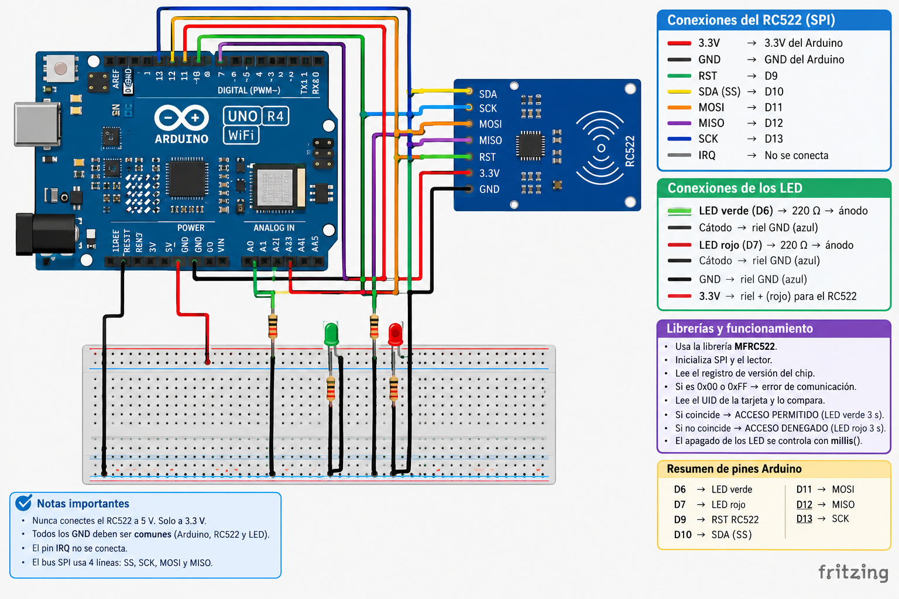
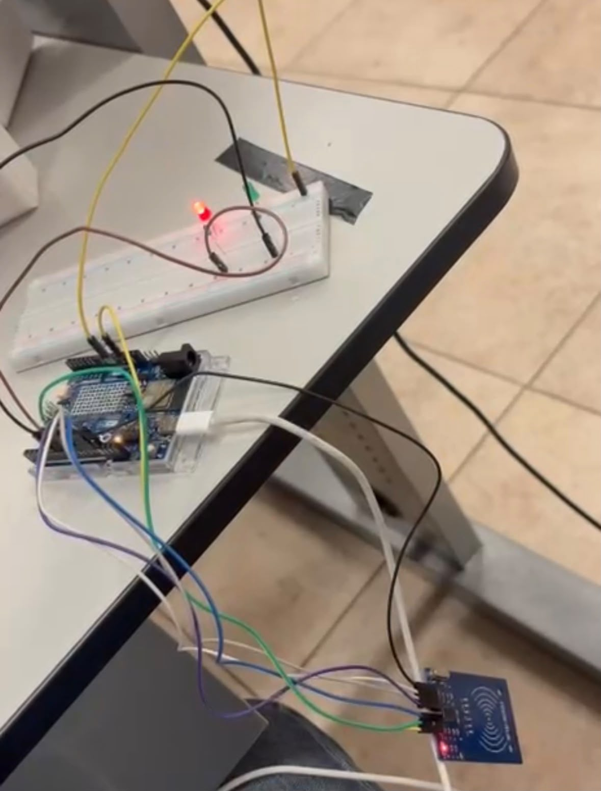

# Control de Acceso con Arduino UNO y Lector RFID RC522

## Descripción

Esta práctica tiene como propósito implementar un sistema de control de acceso mediante un lector RFID RC522 comunicado con un Arduino UNO a través del bus SPI.

El sistema lee el UID de una tarjeta o llavero RFID, lo muestra en el Monitor Serie y lo compara con un UID autorizado almacenado en el programa. Si coincide, se enciende un LED verde indicando acceso permitido; si no coincide, se enciende un LED rojo indicando acceso denegado. Ambos LED se apagan automáticamente después de 3 segundos utilizando `millis()`, sin bloquear la lectura de nuevas tarjetas mediante `delay()`.

## Objetivos

* Comprender el funcionamiento del bus SPI mediante la comunicación entre el Arduino y el módulo RC522.
* Leer e identificar el UID de tarjetas y llaveros RFID de 13.56 MHz.
* Implementar la comparación de un UID leído contra un UID autorizado.
* Controlar LED indicadores de acceso permitido y acceso denegado.
* Utilizar `millis()` para apagar los LED sin bloquear la ejecución del programa.
* Verificar la comunicación SPI leyendo el registro de versión del chip antes de operar.

## Herramientas y material utilizado

* Arduino UNO con cable USB.
* Arduino IDE.
* Módulo lector RFID RC522.
* Tarjeta y llavero RFID (13.56 MHz).
* LED verde y LED rojo.
* 2 resistencias de 220 Ω.
* Protoboard y cables de conexión.
* Librería `MFRC522` (autor GithubCommunity).

## Diagrama

El diagrama muestra las conexiones entre el Arduino UNO, el módulo RC522 (alimentado a 3.3V) y los LED indicadores de acceso.

| RC522 | Arduino UNO | Función |
|---|---|---|
| SDA (SS) | D10 | Selección del esclavo |
| SCK | D13 | Reloj SPI |
| MOSI | D11 | Datos Arduino → RC522 |
| MISO | D12 | Datos RC522 → Arduino |
| IRQ | Sin conectar | No se usa |
| GND | GND | Tierra |
| RST | D9 | Reinicio del lector |
| 3.3V | 3.3V | Alimentación |

| LED | Pin | Resistencia | Cátodo |
|---|---|---|---|
| Verde | D6 | 220 Ω en serie | GND |
| Rojo | D7 | 220 Ω en serie | GND |

> ⚠️ El RC522 se alimenta con 3.3V. Conectarlo a 5V puede dañarlo.

[Ver carpeta Diagramas](DIAGRAMAS)

## Código

El programa verifica la comunicación SPI al arrancar leyendo el registro de versión del chip, y luego queda a la espera de tarjetas. Al detectar una, lee su UID, lo muestra en el Monitor Serie y lo compara contra el UID autorizado (`C7 B4 27 3C` en este proyecto), encendiendo el LED correspondiente durante 3 segundos sin bloquear el programa.

[Ver código](CODIGO/control_acceso_rfid.ino)

## Reporte

El reporte contiene la explicación del funcionamiento del sistema, la metodología utilizada, el análisis de los resultados de las pruebas realizadas y las conclusiones obtenidas durante la práctica.

[Ver Reporte](REPORTE/Reporte_Practica_RC522.pdf)

## Resultados

Durante las pruebas, el Arduino detectó correctamente el módulo RC522 al iniciar, confirmando la comunicación SPI mediante la lectura del registro de versión del chip (valores distintos de `0x00` y `0xFF`). Al acercar la tarjeta autorizada, el sistema mostró `ACCESO PERMITIDO` y encendió el LED verde durante 3 segundos; al acercar una tarjeta no autorizada, mostró `ACCESO DENEGADO` y encendió el LED rojo por el mismo tiempo.

Se comprobó que el uso de `millis()` permitió que el programa siguiera leyendo tarjetas mientras un LED estaba encendido, sin quedar bloqueado como ocurriría con `delay()`. Al desconectar intencionalmente la línea MISO, el sistema reportó correctamente la falla de comunicación con el lector, y al reconectarla y reiniciar, volvió a funcionar con normalidad.

## Video

El video muestra el funcionamiento del sistema de control de acceso, incluyendo la lectura de una tarjeta autorizada y una no autorizada, así como la respuesta del sistema ante una falla de comunicación con el lector.

[Ver video](https://youtu.be/aFCSiKvfGaE)

[Ver carpeta Video](VIDEO)

## Conclusiones

La práctica permitió comprender el funcionamiento del bus SPI mediante la comunicación entre el Arduino UNO y el módulo lector RC522, identificando las líneas necesarias (SS, SCK, MOSI, MISO) y su función dentro de la comunicación maestro-esclavo.

El uso del UID como identificador único permitió implementar un sistema de control de acceso simple pero funcional, mientras que la verificación de la comunicación SPI al inicio del programa permitió detectar de forma temprana errores de cableado. El uso de `millis()` en lugar de `delay()` resultó fundamental para mantener el sistema respondiendo a nuevas lecturas sin bloquear el programa mientras los LED permanecían encendidos.

En conjunto, la práctica permitió relacionar la comunicación por bus SPI con una aplicación práctica de control de acceso, comprobando su funcionamiento mediante el circuito armado y las pruebas realizadas con distintas tarjetas.
